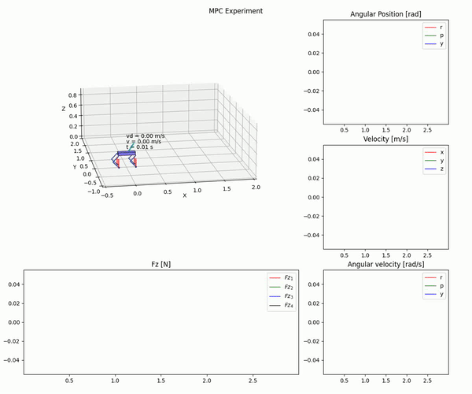

# Python implemenation of a LTV MPC for Quadruped Locomotion
reference preprint: https://arxiv.org/abs/2212.05154

**Authors:** Arturo Flores 





This work presents an existing state-of-the-art optimal controller for quadruped locomotion using Python. The robot dynamics is represented using a single rigid body (SRB) model. A linear time-varying model predictive controller (LTV MPC) is proposed by using linearization schemes. Simulation results show that the LTV MPC can execute various gaits, such as trot and crawl, and is capable of tracking desired reference trajectories even under unknown external disturbances. The LTV MPC is implemented as a quadratic program using $qpOASES$ through the $CasADi$ interface at 50 Hz. The proposed MPC can reach up to 1 m/s top speed with an acceleration of 0.5 m/s$^2$ executing a trot gait. The current results a pretty slow, but we are actively working on this to speed up the process.

## Requirements
Create a python virtual environment (recommended)

```
python3 -m venv <myenvname>
```

After sourcing into it, install the requirements.txt

```
pip install -r requirements.txt
```

## Run
Navigate to main directory and run main.py. Create a folder 'Figures_Python' in the root directory to store all the data from each experiment.


## References
- Di Carlo, Jared, et al. "Dynamic locomotion in the mit cheetah 3 through convex model-predictive control." 2018 IEEE/RSJ international conference on intelligent robots and systems (IROS). IEEE, 2018.
- Ding, Yanran, et al. "Representation-free model predictive control for dynamic motions in quadrupeds." IEEE Transactions on Robotics 37.4 (2021): 1154-1171.

